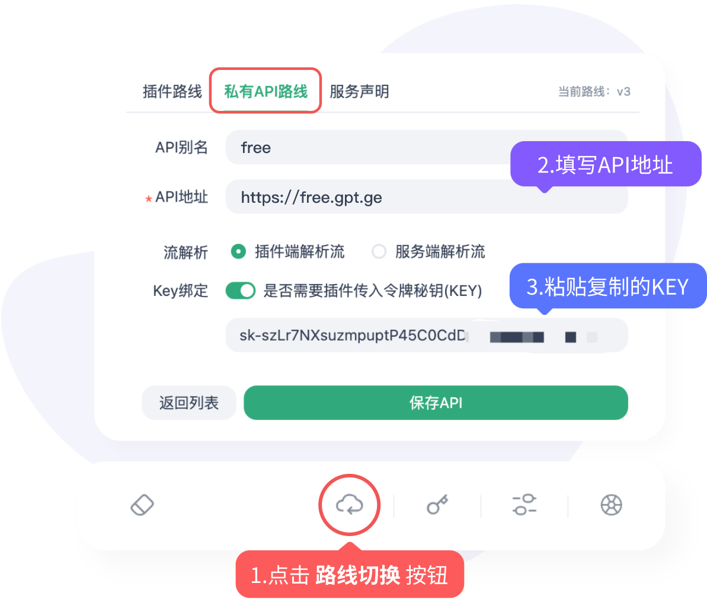
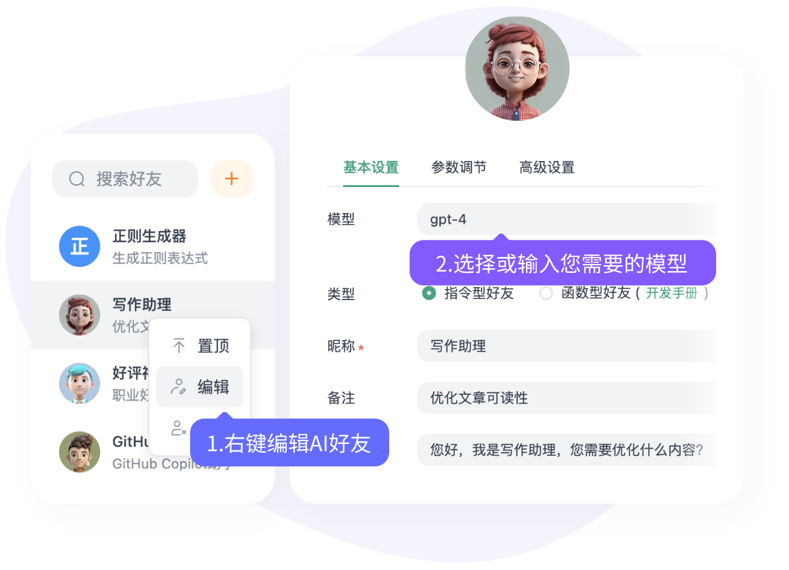
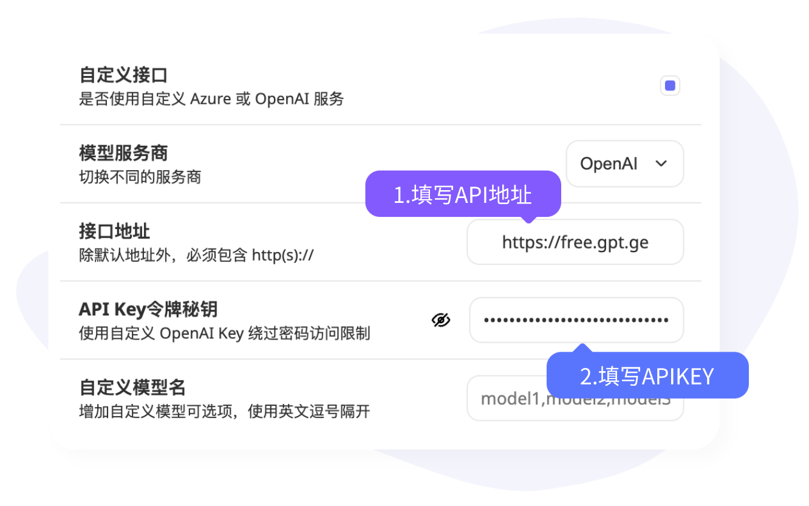
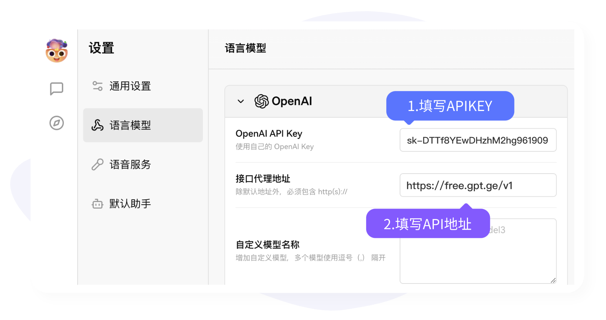

<p align="center">
  <a href="https://github.com/popjane/free_chatgpt_api"></a>
</p>

<div align="center">

# FREE-CHATGPT-API

Use ChatGPT API for free with standard OpenAI format

</div>

<p align="center">
  <a href="./README.md">中文</a> | 
  <strong>English</strong>
</p>

<p align="center">
  
</p>

<p align="center">
  <a href="#project-introduction">Quick Start</a>
  ·
  <a href="#free-usage">Usage</a>
  ·
  <a href="https://free.v36.cm/github" target="_blank">Get Free KEY Now</a>
  ·
  <a href="#paid-api">Premium API</a>
  ·
  <a href="#supported-applications">Application Support</a>
</p>


> [!NOTE]
> The current API address for this project has been updated to `https://free.v36.cm`. Please take note!

> [!IMPORTANT]
> Users must comply with OpenAI's [Terms of Use](https://openai.com/policies/terms-of-use) and **applicable laws and regulations**, and must not use it for illegal purposes.
> According to the [Interim Measures for the Management of Generative Artificial Intelligence Services](http://www.cac.gov.cn/2023-07/13/c_1690898327029107.htm), please do not provide any generative artificial intelligence services without proper registration to the public in China.
> This project API is only for non-commercial legal purposes such as learning, research, and scientific testing. It must not be used for any illegal or commercial purposes, otherwise you bear all consequences.

> [!TIP]
> This project is for personal learning only, does not guarantee stability, and does not provide any technical support.
> We have detected hundreds of bot accounts automatically claiming KEYs and running APIs in bulk, which seriously affects normal users. Currently, RPM is limited to 96, exceeding which will be blocked by CC protection.
> This is a public welfare project, please do not use it with high concurrency. If you need high-concurrency API requests, please support our paid API!

## Project Introduction

1. Completely free access to the following models:
   + [x] gpt-4o-mini
   + [x] gpt-3.5-turbo-0125
   + [x] gpt-3.5-turbo-1106
   + [x] gpt-3.5-turbo
   + [x] gpt-3.5-turbo-16k
   + [ ] text-series models, e.g., text-davinci (text series models removed from free version)
   + [ ] gpt-4 series (only periodically available in limited quantities)
   + [ ] Paid API supports all OpenAI models, including (web search, image generation, chat, embeddings, vision, file analysis, GPTs, etc.)
   + [ ] Paid API supports Midjourney professional image generation, Suno music generation, PPT generation, multiple video models, and over 500 models in total.
2. Standard OpenAI API request format (paid version additionally supports Claude/Gemini native request formats).
3. Supports streaming response output.
4. Perfectly compatible with various open-source GPT projects/applications/software.

## Free Usage

1. First, [🚀 **Get Your Free APIKEY**](https://free.v36.cm/github) and keep it safe.
2. Copy the free API address: `https://free.v36.cm` (no proxy needed, directly accessible).
3. Bind your APIKEY + API address (`BASE_URL`) in supported applications to start using (see [Supported Applications](#supported-applications) list).

As the user base grows, we will improve service quality accordingly to provide better free services. If you encounter any issues, please submit them in [issues](https://github.com/popjane/free_chatgpt_api/issues), and we will assist as soon as possible.

## Paid API

> [!NOTE]
> To ensure the sustainable development of the project, we realize that relying solely on free public welfare Keys is difficult to maintain long-term. Note: Free API does not provide any technical support. If you need stable high-concurrency API requests, please support our paid API. We sincerely hope for your understanding and support of this decision.
> 
> [🚀 **Purchase Official Direct-Connect Paid API**](https://api.v36.cm) 
> 
> Paid APIKEYs are not interchangeable with free APIKEYs. After purchase, you need to regenerate the KEY according to the card details.

### Paid API Features

1. Lower latency, high performance, high availability, high concurrency, direct connection to official API (no reverse engineering, no multi-layer proxying, non-Azure), enjoy the ultimate experience.
2. Supports all OpenAI models, including (web search, image generation, chat, training, vision, GPTs, etc.), currently supporting 130+ models.
3. GPT-4 prices are only 2.8-3x lower than official prices, GPT-3.5 series models are 1.4-2x lower, extremely affordable.
4. Transparent pricing strategy, model billing rates synchronized with official rates (or even lower), never secretly adjusted, no low-price-high-rate traps.
5. No time limit, pay-as-you-go, detailed billing available, every expense is transparent.
6. API is only for non-commercial legal purposes such as learning, research, and scientific testing. It must not be used for any illegal purposes or to provide generative services to the Chinese public, otherwise you bear all consequences.

## Supported Applications

> [!NOTE]
> Theoretically supports all GPT applications that allow custom API addresses. Below are some commonly used applications.
>
> The API address (BaseUrl) for all applications is `https://free.v36.cm`
> Please replace the API address prefix in tutorial images with `https://free.v36.cm`

### 1. ChatGPT.Friend Plugin

> This is a utools plugin that supports custom models, one-click invocation, instant use, super panel, and can quickly send messages from anywhere on PC. Supports AI chat, image generation, voice dialogue, multi-API management, multi-key binding, role-specific chat history, one-click balance check. A desktop powerhouse, but does not support mobile.
>
> A very comprehensive AI chat application plugin.
> 
> [**View Application**](https://u.tools/plugins/detail/ChatGPT.%E5%A5%BD%E5%8F%8B/)

Binding tutorial screenshot:



After successful binding, right-click the AI list and select the desired model.



### 2. Open Source Application Chatgpt-next-web (ChatGPT-Midjourney)

> [Open Source Chatgpt-next-web](https://github.com/ChatGPTNextWeb/ChatGPT-Next-Web) This is an open-source web chat tool that only supports chat.
> 
> [Open Source ChatGPT-Midjourney](https://github.com/Licoy/ChatGPT-Midjourney) Modified version that supports Midjourney dialogue.

Binding tutorial screenshot:

Click the settings icon. Find custom interface settings and configure as follows:


### 3. Lobe-chat

> [Lobe-chat](https://github.com/lobehub/lobe-chat) is an open-source chat application that supports chat, image generation, voice dialogue, etc.

Binding tutorial screenshot:



### 4. BotGem

> [BotGem](https://botgem.com/) Non-open-source tool, supports PC and mobile, single function, only supports chat, but multi-platform compatible.

Binding method is similar to the above tutorial screenshots, fill in the free API address `https://free.v36.cm` + `apikey`.

### 5. ChatBox

> [ChatBox](https://github.com/Bin-Huang/chatbox) Supports desktop APP version and web version, click the setting button to configure.

Binding method is similar to the above tutorial screenshots, fill in the free API address `https://free.v36.cm` + `apikey`.

### 6. FastGPT

> [FastGPT](https://github.com/labring/FastGPT) Chat application with knowledge base support.

When deploying, fill in the host parameter with `https://free.v36.cm` and pass in our `apikey`.

### More Application Support

To be updated...

### OpenAI Official Python Library

> When developing with the official OpenAI library, pass in the baseurl and apikey.
>
> [openai-python](https://github.com/openai/openai-python)

Using the official `python` library as an example: Note that you need to pass the `/v1/` suffix. Also, the openai library needs to be upgraded to the latest version; older versions have different parameter formats. Please refer to the official Python library documentation for details.

```python
import os
import openai

# optional; defaults to `os.environ['OPENAI_API_KEY']`
openai.api_key = "Your APIKEY"

# all client options can be configured just like the `OpenAI` instantiation counterpart
openai.base_url = "https://free.v36.cm/v1/"
openai.default_headers = {"x-foo": "true"}

completion = openai.chat.completions.create(
    model="gpt-4o-mini",
    messages=[
        {
            "role": "user",
            "content": "Hello world!",
        },
    ],
)
print(completion.choices[0].message.content)

# Should output: Hello there! How can I assist you today?
```

### OpenAI Official Node Library

> [openai-node](https://github.com/openai/openai-node)

Using the official `node` library as an example: Note that you need to pass the /v1 suffix.

```js
const { Configuration, OpenAIApi } = require("openai");

const configuration = new Configuration({
  apiKey: "Your apikey",
  basePath: "https://free.v36.cm/v1"
});
const openai = new OpenAIApi(configuration);

const chatCompletion = await openai.createChatCompletion({
  model: "gpt-3.5-turbo",
  messages: [{role: "user", content: "Hello world"}],
});

console.log(chatCompletion.data.choices[0].message.content);
```


## Related Projects

[OpenAI Plus Top-up](https://github.com/popjane/openai-chatgpt-plus)
